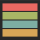

  

# Gruvbox Material Dark

**Dark Theme** - inspired by
the [Gruvbox Material](https://github.com/sainnhe/gruvbox-material?tab=readme-ov-file)
theme.

**[Light Theme Version](https://github.com/Ebyrdeu/gruvbox-material-light)**
## Supported Languages

- Java
- Rust
- Go
- Python
- C/C++
- JavaScript / TypeScript

## Screenshots

*Gruvbox Material Dark (Soft)*

*Gruvbox Material Dark (Medium)*

*Gruvbox Material Dark (Hard)*

## License

[LICENSE](LICENSE) @ebyrdeu